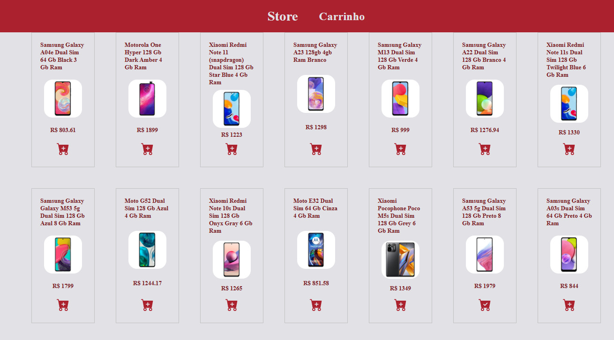
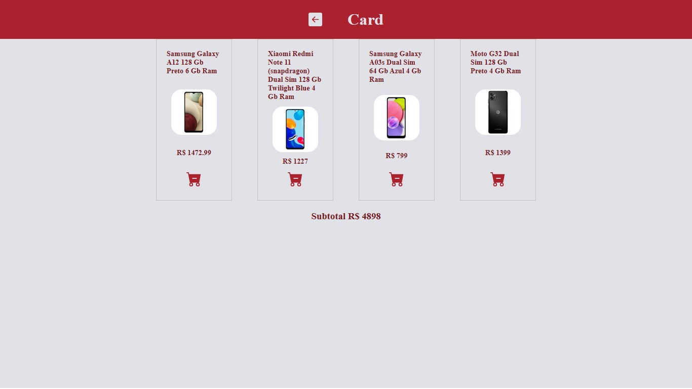

# Api-mercadoLivre

### 💻 A  Api-mercadoLivre made with React JS, Hooks, consuming the Api-mercadoLivre. <hr/>
#### Os produtos mostrados em tela, podemos ver os valores e adiciona-los no carrinho de compras e ver o valor total ao final. <br/><br/>

### Preview


<br/> <br/>

## Carrinho com as compras


<br/> <br/>

### 🛠️ Technologies 
React with type script<br/>
Api-mercadoLivre
React-router-dom<br/>
React-icons<br/>
Styled-components<br/>


## 🧲 Requirements 
Git<br/>
Node.js <br/>
NPM

## Installation

```
$ git clone https://github.com/eltonfreitasx/Api-mercadoLivre.git

$ npm install

$ npm start<br/>
```

The application will open in the browser on http://localhost:3000

